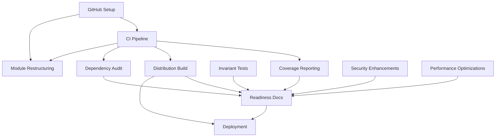

# وثيقة التصميم الفني — الجاهزية الإنتاجية النهائية لفجر الوادي

## نظرة عامة

### الهدف
تحويل مشروع فجر الوادي من حالة **"صالح كمرشح إصدار محليًا"** إلى حالة **GO** كاملة جاهزة للإنتاج من خلال معالجة 12 متطلبًا رئيسيًا تغطي الحوكمة، الجودة، التوزيع، الأمان، الأداء، والتوثيق.

### نطاق التصميم
يغطي هذا التصميم التنفيذ الفني للمتطلبات P0-P3 المحددة في `requirements.md`:

**P0 (حرجة):**
- إعداد GitHub وحوكمة الكود
- تغطية صريحة للثوابت المحاسبية (14، 17، 18)
- توثيق الجاهزية

**P1 (عالية):**
- إعادة الهيكلة المعمارية
- التوزيع متعدد المنصات
- تقرير التغطية

**P2-P3 (متوسطة-منخفضة):**
- تدقيق التبعيات
- تحسينات الأمان والأداء
- قابلية الاستخدام والترقية والنشر

### المبادئ التوجيهية
1. **الحفاظ على السلامة المحاسبية**: أي تغيير يجب ألا ينتهك الثوابت الـ20
2. **الأمان أولاً**: كل تحسين يجب أن يعزز الأمان لا أن يضعفه
3. **قابلية الصيانة**: تفضيل الحلول البسيطة على المعقدة
4. **التوافقية**: ضمان التشغيل على macOS 11+، Windows 10+، Ubuntu 20.04+
5. **التوثيق المستمر**: كل تغيير معماري يُوثق فورًا


## المعمارية

### الحالة الحالية
```
┌──────────────────────────────────────────────┐
│           Tauri Desktop App                  │
├──────────────────────────────────────────────┤
│  Frontend: React 19 + TypeScript 5 + Vite 8  │
│  - 71 ملف TS/TSX                              │
│  - Tailwind CSS للتنسيق                      │
│  - 90 اختبار Vitest                          │
├──────────────────────────────────────────────┤
│  Backend: Rust 1.97 + Tauri 2.11             │
│  - legacy.rs (~21,500 سطر) + 18 وحدة         │
│  - 133 اختبار Rust + 1 integration           │
│  - 8 اختبارات Backend Bridge                 │
├──────────────────────────────────────────────┤
│  Database: SQLite + rusqlite 0.32            │
│  - 36 migration                               │
│  - Decimal precision (rust_decimal)           │
│  - 20 ثابت محاسبي                            │
└──────────────────────────────────────────────┘
```

### المعمارية المستهدفة

```
┌─────────────────────────────────────────────────────────┐
│                  GitHub Repository                       │
│  - Branch Protection (main protected)                    │
│  - Required CI Checks                                    │
│  - Code Review Required                                  │
│  - Signed Commits (optional)                             │
└─────────────────────────────────────────────────────────┘
                          │
                          ▼
┌─────────────────────────────────────────────────────────┐
│              GitHub Actions CI/CD Pipeline               │
│  ┌─────────────┐  ┌──────────────┐  ┌────────────────┐ │
│  │  Frontend   │  │   Backend    │  │  Distribution  │ │
│  │  Quality    │  │   Quality    │  │    Build       │ │
│  │  Gates      │  │   Gates      │  │    & Test      │ │
│  └─────────────┘  └──────────────┘  └────────────────┘ │
│         │                 │                  │           │
│         └─────────────────┴──────────────────┘           │
│                           │                               │
│                   ✅ All Gates Pass                       │
└─────────────────────────────────────────────────────────┘
                          │
                          ▼
┌─────────────────────────────────────────────────────────┐
│             Tauri Build System (Multi-Platform)          │
│  ┌──────────────┐  ┌──────────────┐  ┌──────────────┐  │
│  │  macOS .dmg  │  │ Windows .msi │  │ Linux .AppI  │  │
│  │  Code-signed │  │  Code-signed │  │  GTK3 deps   │  │
│  └──────────────┘  └──────────────┘  └──────────────┘  │
└─────────────────────────────────────────────────────────┘
                          │
                          ▼
┌─────────────────────────────────────────────────────────┐
│               Production Application                     │
│  ┌──────────────────────────────────────────────────┐   │
│  │  Modular Rust Backend (< 2000 lines/module)     │   │
│  │  ┌────────┐  ┌────────┐  ┌────────────────────┐ │   │
│  │  │ Domain │  │ Infra  │  │    Accounting      │ │   │
│  │  │ Models │  │ Layer  │  │      Core          │ │   │
│  │  └────────┘  └────────┘  └────────────────────┘ │   │
│  └──────────────────────────────────────────────────┘   │
│  ┌──────────────────────────────────────────────────┐   │
│  │  React Frontend + Performance Optimizations      │   │
│  │  - Lazy Loading                                  │   │
│  │  - Pagination                                    │   │
│  │  - Optimized Bundles (< 300 KB max chunk)       │   │
│  └──────────────────────────────────────────────────┘   │
│  ┌──────────────────────────────────────────────────┐   │
│  │  SQLite Database                                 │   │
│  │  - Indexed Queries                               │   │
│  │  - Optimistic Locking                            │   │
│  │  - Automated Backup                              │   │
│  └──────────────────────────────────────────────────┘   │
└─────────────────────────────────────────────────────────┘
```


## المكونات والواجهات

### 1. GitHub Integration Layer

#### 1.1 Remote Repository Setup
```rust
// src-tauri/src/infrastructure/git.rs
pub struct GitConfig {
    pub remote_url: String,
    pub branch: String,
}

pub fn verify_git_remote() -> Result<GitConfig, String> {
    // Verify git remote origin exists
    // Return remote URL and current branch
}

pub fn verify_branch_protection() -> Result<BranchProtectionStatus, String> {
    // Query GitHub API for branch protection rules
    // Verify: required_status_checks, required_approving_review_count
}
```

#### 1.2 CI Pipeline Configuration
التحديثات المطلوبة على `.github/workflows/ci.yml`:

```yaml
# إضافة coverage reporting
- name: Generate Rust coverage
  run: |
    cargo install cargo-tarpaulin --locked
    cargo tarpaulin --workspace --all-features --timeout 300 \
      --out Xml --output-dir coverage

- name: Generate TypeScript coverage  
  run: npm test -- --coverage --run

- name: Upload coverage artifacts
  uses: actions/upload-artifact@v4
  with:
    name: coverage-reports
    path: |
      coverage/
      target/coverage/

# إضافة distribution build testing
distribution:
  strategy:
    matrix:
      os: [macos-latest, windows-latest, ubuntu-latest]
  runs-on: ${{ matrix.os }}
  steps:
    - uses: actions/checkout@v4
    - name: Build release package
      run: npm run tauri build
    - name: Run smoke test
      run: python3 scripts/smoke_test_package.py dist/
```

### 2. Module Restructuring Layer

#### 2.1 Target Module Structure
```
src-tauri/src/
├── lib.rs (entry point, < 200 lines)
├── main.rs (< 50 lines)
├── money.rs (unchanged)
├── types.rs (shared types)
├── accounting/
│   ├── mod.rs (< 200 lines)
│   ├── ledger.rs (< 2000 lines)
│   └── reconciliation.rs (< 2000 lines)
├── domains/
│   ├── cars/
│   │   ├── mod.rs
│   │   ├── repository.rs (< 2000 lines)
│   │   ├── service.rs (< 2000 lines)
│   │   └── commands.rs (< 1000 lines)
│   ├── partners/
│   │   └── (similar structure)
│   ├── installments/
│   │   └── (similar structure)
│   ├── agencies/
│   │   └── (similar structure)
│   └── expenses/
│       └── (similar structure)
├── infrastructure/
│   ├── db/
│   │   ├── mod.rs
│   │   ├── migrations.rs (< 2000 lines)
│   │   └── connection.rs (< 500 lines)
│   ├── backup.rs (unchanged)
│   └── audit.rs (< 1000 lines)
└── legacy/ (temporary, للتوافقية أثناء الانتقال)
    └── (existing modules)
```

#### 2.2 Module Boundaries

```rust
// src-tauri/src/domains/cars/repository.rs
pub trait CarRepository {
    fn get_car(&self, car_number: &str) -> Result<Car, String>;
    fn save_car(&self, car: &Car) -> Result<(), String>;
    fn list_cars(&self, filters: CarFilters) -> Result<Vec<Car>, String>;
}

// src-tauri/src/domains/cars/service.rs
pub struct CarService {
    repo: Box<dyn CarRepository>,
    ledger: Box<dyn LedgerService>,
}

impl CarService {
    pub fn create_car(&self, cmd: CreateCarCommand) -> Result<Car, String> {
        // Business logic only
        // No SQL, no direct DB access
    }
}
```


### 3. Explicit Invariant Testing Layer

#### 3.1 Invariant 14: Read-Only Functions Test
```rust
// src-tauri/src/accounting/tests/invariants.rs

#[test]
fn test_read_only_functions_dont_write() {
    let db = open_test_db_in_memory();
    
    // Get initial data version
    let initial_version: i64 = db
        .query_row("PRAGMA data_version", [], |row| row.get(0))
        .unwrap();
    
    // Call all read-only functions
    let _ = get_financial_summary(&db, None);
    let _ = get_cash_register_entries(&db, None, None);
    let _ = get_profit_distribution_summary(&db);
    let _ = get_partners_totals(&db);
    let _ = get_unified_accounts(&db);
    let _ = get_partner_transactions(&db, None, None, None);
    let _ = get_cars(&db, None);
    
    // Verify data version unchanged
    let final_version: i64 = db
        .query_row("PRAGMA data_version", [], |row| row.get(0))
        .unwrap();
    
    assert_eq!(
        initial_version, final_version,
        "Read-only functions modified database: version changed from {} to {}",
        initial_version, final_version
    );
}
```

#### 3.2 Invariant 17: Qasa Tab = Qasa Card
```rust
#[test]
fn test_qasa_tab_equals_qasa_card() {
    let db = reset_to_two_test_partners();
    
    // Create cash sale scenario
    let car = create_test_car(&db, "ABC123", dec!(15_000_000));
    sell_car_cash(&db, &car.car_number, dec!(20_000_000));
    
    // Get Qasa from financial summary (Dashboard Card)
    let summary = get_financial_summary(&db, None).unwrap();
    let qasa_card_iqd = summary.qasa_iqd;
    
    // Get Qasa from cash register (Qasa Tab)
    let entries = get_cash_register_entries(
        &db,
        Some("qasa"),  // Filter: Qasa only
        None
    ).unwrap();
    
    let qasa_tab_iqd: Decimal = entries
        .iter()
        .filter(|e| e.affects_qasa)
        .filter(|e| e.kind == "شريك" || e.kind == "مستثمر")
        .map(|e| e.debit.0 - e.credit.0)
        .sum();
    
    assert_eq!(
        qasa_card_iqd, qasa_tab_iqd,
        "Qasa mismatch: Dashboard Card shows {:?}, Qasa Tab shows {:?}",
        qasa_card_iqd, qasa_tab_iqd
    );
}
```

#### 3.3 Invariant 18: Cash Tab = Cash Card
```rust
#[test]
fn test_cash_tab_equals_cash_card() {
    let db = reset_to_two_test_partners();
    
    // Create mixed scenario: partner cash + investor deposit
    let car = create_test_car(&db, "XYZ789", dec!(10_000_000));
    sell_car_cash(&db, &car.car_number, dec!(15_000_000));
    add_investor_deposit(&db, dec!(5_000_000), "IQD");
    
    // Get Cash from financial summary (Dashboard Card)
    let summary = get_financial_summary(&db, None).unwrap();
    let cash_card_iqd = summary.cash_iqd;
    
    // Get Cash from cash register (Cash Tab)
    let entries = get_cash_register_entries(
        &db,
        Some("cash"),  // Filter: Cash only (partners, not investors)
        None
    ).unwrap();
    
    let cash_tab_iqd: Decimal = entries
        .iter()
        .filter(|e| e.affects_partner_cash)
        .filter(|e| e.kind == "شريك")  // Exclude investors
        .map(|e| e.debit.0 - e.credit.0)
        .sum();
    
    assert_eq!(
        cash_card_iqd, cash_tab_iqd,
        "Cash mismatch: Dashboard Card shows {:?}, Cash Tab shows {:?}",
        cash_card_iqd, cash_tab_iqd
    );
}
```


### 4. Multi-Platform Distribution Layer

#### 4.1 Build Pipeline Structure
```yaml
# .github/workflows/release.yml
name: Release Build

on:
  push:
    tags:
      - 'v*'
  workflow_dispatch:

jobs:
  build:
    strategy:
      fail-fast: false
      matrix:
        include:
          - os: macos-latest
            target: x86_64-apple-darwin
            artifact: .dmg
          - os: macos-latest
            target: aarch64-apple-darwin
            artifact: .dmg
          - os: windows-latest
            target: x86_64-pc-windows-msvc
            artifact: .msi
          - os: ubuntu-20.04
            target: x86_64-unknown-linux-gnu
            artifact: .AppImage
    
    runs-on: ${{ matrix.os }}
    
    steps:
      - uses: actions/checkout@v4
      
      - name: Install system dependencies (Linux)
        if: matrix.os == 'ubuntu-20.04'
        run: |
          sudo apt-get update
          sudo apt-get install -y \
            libwebkit2gtk-4.1-dev \
            libgtk-3-dev \
            libayatana-appindicator3-dev \
            librsvg2-dev \
            patchelf
      
      - name: Setup Rust
        uses: dtolnay/rust-toolchain@stable
        with:
          targets: ${{ matrix.target }}
      
      - name: Setup Node
        uses: actions/setup-node@v4
        with:
          node-version: 22
          cache: npm
      
      - name: Install dependencies
        run: npm ci
      
      - name: Build Tauri app
        run: npm run tauri build -- --target ${{ matrix.target }}
      
      - name: Sign macOS app
        if: matrix.os == 'macos-latest'
        env:
          APPLE_CERTIFICATE: ${{ secrets.APPLE_CERTIFICATE }}
          APPLE_CERTIFICATE_PASSWORD: ${{ secrets.APPLE_CERTIFICATE_PASSWORD }}
        run: |
          # Import certificate
          echo $APPLE_CERTIFICATE | base64 --decode > certificate.p12
          security create-keychain -p actions temp.keychain
          security import certificate.p12 -k temp.keychain -P $APPLE_CERTIFICATE_PASSWORD
          # Sign
          codesign --force --sign "Developer ID" \
            src-tauri/target/${{ matrix.target }}/release/bundle/dmg/*.dmg
      
      - name: Sign Windows app
        if: matrix.os == 'windows-latest'
        env:
          WINDOWS_CERTIFICATE: ${{ secrets.WINDOWS_CERTIFICATE }}
        run: |
          # Sign with signtool
          signtool sign /f certificate.pfx /p $env:WINDOWS_CERTIFICATE \
            src-tauri/target/${{ matrix.target }}/release/bundle/msi/*.msi
      
      - name: Generate checksums
        run: |
          cd src-tauri/target/${{ matrix.target }}/release/bundle
          sha256sum *${{ matrix.artifact }} > checksums.txt
      
      - name: Upload artifacts
        uses: actions/upload-artifact@v4
        with:
          name: release-${{ matrix.os }}-${{ matrix.target }}
          path: |
            src-tauri/target/${{ matrix.target }}/release/bundle/*${{ matrix.artifact }}
            src-tauri/target/${{ matrix.target }}/release/bundle/checksums.txt
```

#### 4.2 Smoke Test Suite
```python
# scripts/smoke_test_package.py
import subprocess
import sys
import os
from pathlib import Path

def test_package(package_path: str) -> bool:
    """
    Smoke test for installed package:
    1. Initialize database
    2. Authenticate admin
    3. Create test car
    4. Verify database integrity
    """
    # Platform-specific launch
    if package_path.endswith('.dmg'):
        return test_macos_dmg(package_path)
    elif package_path.endswith('.msi'):
        return test_windows_msi(package_path)
    elif package_path.endswith('.AppImage'):
        return test_linux_appimage(package_path)
    else:
        print(f"Unknown package format: {package_path}")
        return False

def test_linux_appimage(app_path: str) -> bool:
    # Make executable
    os.chmod(app_path, 0o755)
    
    # Run in headless mode with test commands
    result = subprocess.run([
        app_path,
        '--test-mode',
        '--test-sequence', 'init_db,auth_admin,create_car,verify_integrity'
    ], capture_output=True, timeout=30)
    
    return result.returncode == 0 and b"All tests passed" in result.stdout
```


### 5. Coverage Reporting Layer

#### 5.1 Rust Coverage Configuration
```toml
# src-tauri/tarpaulin.toml
[config]
workspace = true
all-features = true
timeout = 300
out = ["Xml", "Html", "Lcov"]
output-dir = "../coverage/rust"
exclude-files = [
    "src-tauri/src/main.rs",
    "src-tauri/src/e2e_bridge.rs",
    "src-tauri/src/*/tests/*"
]
ignore-panics = true
count = true
```

#### 5.2 TypeScript Coverage Configuration
```typescript
// vitest.config.ts - تحديثات
export default defineConfig({
  test: {
    coverage: {
      provider: 'v8',
      reporter: ['text', 'json', 'html', 'lcov'],
      reportsDirectory: './coverage/typescript',
      exclude: [
        'node_modules/',
        'test/',
        'scripts/',
        'dist/',
        '**/*.d.ts',
        '**/*.config.*',
        '**/mockData.*',
      ],
      statements: 75,
      branches: 70,
      functions: 75,
      lines: 75,
      // Enforce thresholds
      thresholds: {
        global: {
          statements: 75,
          branches: 70,
          functions: 75,
          lines: 75
        },
        // Stricter for accounting modules
        './src/utils/finance.ts': {
          statements: 90,
          branches: 85,
          functions: 90,
          lines: 90
        }
      }
    }
  }
});
```

#### 5.3 Coverage Report Aggregation
```typescript
// scripts/aggregate_coverage.ts
interface CoverageReport {
  rust: {
    line_coverage: number;
    branch_coverage: number;
    files: number;
  };
  typescript: {
    line_coverage: number;
    branch_coverage: number;
    files: number;
  };
}

async function aggregateCoverage(): Promise<CoverageReport> {
  // Parse Rust XML coverage
  const rustXml = await fs.readFile('coverage/rust/cobertura.xml', 'utf-8');
  const rustData = parseRustCoverage(rustXml);
  
  // Parse TypeScript JSON coverage
  const tsJson = await fs.readFile('coverage/typescript/coverage-final.json', 'utf-8');
  const tsData = parseTsCoverage(JSON.parse(tsJson));
  
  // Generate combined report
  return {
    rust: rustData,
    typescript: tsData
  };
}

// Generate HTML dashboard
async function generateDashboard(report: CoverageReport) {
  const html = `
    <h1>Fajr Alwadi Coverage Report</h1>
    <div class="summary">
      <div class="rust">
        <h2>Rust Backend</h2>
        <p>Line Coverage: ${report.rust.line_coverage}%</p>
        <p>Branch Coverage: ${report.rust.branch_coverage}%</p>
      </div>
      <div class="typescript">
        <h2>TypeScript Frontend</h2>
        <p>Line Coverage: ${report.typescript.line_coverage}%</p>
        <p>Branch Coverage: ${report.typescript.branch_coverage}%</p>
      </div>
    </div>
  `;
  
  await fs.writeFile('coverage/index.html', html);
}
```


### 6. Dependency Audit Layer

#### 6.1 Rust Audit Policy
```toml
# src-tauri/.cargo/audit.toml
[advisories]
ignore = [
    "RUSTSEC-2024-0429",  # glib gtk3 unmaintained - transitive via Tauri, no patch available
]

[output]
deny = ["unmaintained"]
format = "json"

[database]
fetch = true
```

#### 6.2 Automated Dependency Monitoring
```yaml
# .github/workflows/dependency-audit.yml
name: Dependency Audit

on:
  schedule:
    - cron: '0 0 * * 0'  # Weekly Sunday midnight
  workflow_dispatch:

jobs:
  audit:
    runs-on: ubuntu-latest
    steps:
      - uses: actions/checkout@v4
      
      - name: Audit Rust dependencies
        run: |
          cargo install cargo-audit --locked
          cd src-tauri
          cargo audit --json > audit-report.json
          
      - name: Check for critical vulnerabilities
        run: |
          python3 scripts/check_audit_critical.py src-tauri/audit-report.json
          
      - name: Audit npm dependencies
        run: |
          npm audit --audit-level=high --json > npm-audit.json
          
      - name: Create issue if vulnerabilities found
        if: failure()
        uses: actions/github-script@v7
        with:
          script: |
            github.rest.issues.create({
              owner: context.repo.owner,
              repo: context.repo.repo,
              title: 'Security: Critical Vulnerabilities Detected',
              body: 'Automated audit found critical vulnerabilities. See workflow run for details.',
              labels: ['security', 'dependencies']
            })
```

#### 6.3 Dependency Update Policy
```markdown
# docs/DEPENDENCY_POLICY.md

## Dependency Management Policy

### Update Frequency
- **Security patches**: Immediate (within 24 hours)
- **Minor updates**: Monthly review
- **Major updates**: Quarterly review with testing

### Pinning Strategy
All production dependencies pinned to exact versions:
- Rust: `dependency = "=1.2.3"` (exact)
- npm: `package.json` uses exact versions (no ^ or ~)

### Exceptions
Known unmaintained dependencies with documented risk acceptance:

1. **glib (via Tauri GTK3)**
   - Status: Unmaintained
   - Risk: Low - isolated to Linux platform layer
   - Mitigation: Monitor Tauri upstream for GTK4 migration
   - Review: Annually or when Tauri updates

2. **unic-* (transitive)**
   - Status: Unmaintained
   - Risk: Very Low - Unicode normalization only
   - Mitigation: No user input processed by these libs
   - Review: Annually

### Approval Process
Major version updates require:
1. Full test suite pass
2. Performance regression check
3. Security audit review
4. Code review approval
```


### 7. Security Enhancement Layer

#### 7.1 Enhanced Audit Logging
```rust
// src-tauri/src/infrastructure/audit.rs

#[derive(Debug, Serialize)]
pub struct AuditEvent {
    pub id: i64,
    pub timestamp: String,
    pub event_type: String,
    pub user: String,
    pub action: String,
    pub entity_type: Option<String>,
    pub entity_id: Option<String>,
    pub details: serde_json::Value,
    pub ip_address: Option<String>,
    pub session_id: String,
}

pub fn log_authentication_attempt(
    db: &Connection,
    username: &str,
    success: bool,
    ip: Option<&str>
) -> Result<(), String> {
    let event_type = if success {
        "AUTH_SUCCESS"
    } else {
        "AUTH_FAILED"
    };
    
    db.execute(
        "INSERT INTO audit_log (timestamp, event_type, user, action, details)
         VALUES (datetime('now'), ?, ?, 'login', json_object('ip', ?))",
        params![event_type, username, ip.unwrap_or("unknown")]
    ).map_err(|e| e.to_string())?;
    
    Ok(())
}

pub fn log_password_change(
    db: &Connection,
    user: &str,
    session_id: &str
) -> Result<(), String> {
    db.execute(
        "INSERT INTO audit_log (timestamp, event_type, user, action, details)
         VALUES (datetime('now'), 'SECURITY', ?, 'password_change', 
                 json_object('session_id', ?))",
        params![user, session_id]
    ).map_err(|e| e.to_string())?;
    
    Ok(())
}
```

#### 7.2 Session Management Enhancement
```rust
// src-tauri/src/auth/session.rs

pub struct SessionManager {
    db: Arc<Mutex<Connection>>,
    active_sessions: Arc<RwLock<HashMap<String, SessionInfo>>>,
}

#[derive(Clone)]
pub struct SessionInfo {
    pub session_id: String,
    pub user: String,
    pub created_at: i64,
    pub last_activity: i64,
}

impl SessionManager {
    pub fn invalidate_all_sessions(&self, user: &str) -> Result<(), String> {
        let mut sessions = self.active_sessions.write().unwrap();
        sessions.retain(|_, info| info.user != user);
        
        let db = self.db.lock().unwrap();
        db.execute(
            "DELETE FROM sessions WHERE user = ?",
            params![user]
        ).map_err(|e| e.to_string())?;
        
        Ok(())
    }
    
    pub fn invalidate_session(&self, session_id: &str) -> Result<(), String> {
        let mut sessions = self.active_sessions.write().unwrap();
        sessions.remove(session_id);
        
        let db = self.db.lock().unwrap();
        db.execute(
            "DELETE FROM sessions WHERE session_id = ?",
            params![session_id]
        ).map_err(|e| e.to_string())?;
        
        Ok(())
    }
}
```

#### 7.3 Password Policy Enforcement
```rust
// src-tauri/src/auth/password.rs

pub fn validate_password(password: &str) -> Result<(), String> {
    if password.trim().is_empty() {
        return Err("كلمة المرور لا يمكن أن تكون فارغة".to_string());
    }
    
    if password.len() < 8 {
        return Err("كلمة المرور يجب أن تحتوي على 8 أحرف على الأقل".to_string());
    }
    
    // Check for whitespace-only
    if password.chars().all(|c| c.is_whitespace()) {
        return Err("كلمة المرور لا يمكن أن تكون مسافات فقط".to_string());
    }
    
    Ok(())
}

#[tauri::command]
pub fn change_admin_password(
    state: State<AppState>,
    session_token: Option<String>,
    old_password: String,
    new_password: String
) -> Result<String, String> {
    let db = state.db.lock().unwrap();
    
    // Validate session
    require_admin_session(&db, session_token)?;
    
    // Validate new password
    validate_password(&new_password)?;
    
    // Verify old password
    verify_current_password(&db, &old_password)?;
    
    // Hash new password
    let new_hash = hash_password(&new_password)?;
    
    // Update password
    db.execute(
        "UPDATE admin SET password_hash = ? WHERE id = 1",
        params![new_hash]
    ).map_err(|e| e.to_string())?;
    
    // Invalidate all sessions
    state.session_manager.invalidate_all_sessions("admin")?;
    
    // Log the change
    log_password_change(&db, "admin", &session_token.unwrap_or_default())?;
    
    Ok("تم تغيير كلمة المرور بنجاح".to_string())
}
```


### 8. Performance Optimization Layer

#### 8.1 Database Indexing Strategy
```sql
-- migrations/v46_performance_indexes.sql

-- Cars table indexes
CREATE INDEX IF NOT EXISTS idx_cars_purchase_date 
    ON cars(purchase_date) WHERE purchase_date IS NOT NULL;
CREATE INDEX IF NOT EXISTS idx_cars_sold_date 
    ON cars(sold_date) WHERE sold_date IS NOT NULL;
CREATE INDEX IF NOT EXISTS idx_cars_status 
    ON cars(sold_date) WHERE sold_date IS NULL;  -- Active cars

-- Partner transactions indexes (most queried)
CREATE INDEX IF NOT EXISTS idx_partner_transactions_source 
    ON partner_transactions(source_type, source_id);
CREATE INDEX IF NOT EXISTS idx_partner_transactions_affects 
    ON partner_transactions(affects_qasa, affects_partner_cash, affects_profit)
    WHERE affects_qasa = 1 OR affects_partner_cash = 1 OR affects_profit = 1;
CREATE INDEX IF NOT EXISTS idx_partner_transactions_date 
    ON partner_transactions(date);
CREATE INDEX IF NOT EXISTS idx_partner_transactions_currency 
    ON partner_transactions(currency);

-- Financial ledger indexes
CREATE INDEX IF NOT EXISTS idx_ledger_account_type 
    ON financial_ledger(account_type);
CREATE INDEX IF NOT EXISTS idx_ledger_currency 
    ON financial_ledger(currency);
CREATE INDEX IF NOT EXISTS idx_ledger_date 
    ON financial_ledger(date);

-- Installments indexes
CREATE INDEX IF NOT EXISTS idx_installments_car 
    ON installments(car_number);
CREATE INDEX IF NOT EXISTS idx_installments_due_date 
    ON installments(due_date) WHERE status != 'واصل';

-- Audit log indexes
CREATE INDEX IF NOT EXISTS idx_audit_log_timestamp 
    ON audit_log(timestamp DESC);
CREATE INDEX IF NOT EXISTS idx_audit_log_event_type 
    ON audit_log(event_type);
```

#### 8.2 Query Optimization
```rust
// src-tauri/src/infrastructure/db/optimized_queries.rs

pub fn get_financial_summary_optimized(
    db: &Connection,
    currency_filter: Option<&str>
) -> Result<FinancialSummary, String> {
    // Use optimized query with covering indexes
    let query = "
        SELECT 
            currency,
            SUM(CASE WHEN affects_qasa = 1 THEN debit - credit ELSE 0 END) as qasa,
            SUM(CASE WHEN affects_partner_cash = 1 THEN debit - credit ELSE 0 END) as cash,
            SUM(CASE WHEN affects_profit = 1 THEN debit - credit ELSE 0 END) as profit
        FROM partner_transactions
        WHERE (? IS NULL OR currency = ?)
        GROUP BY currency
    ";
    
    // This query uses idx_partner_transactions_affects
    let mut stmt = db.prepare(query).map_err(|e| e.to_string())?;
    // ... rest of implementation
}

pub fn get_cars_with_pagination(
    db: &Connection,
    page: u32,
    page_size: u32,
    filters: CarFilters
) -> Result<PaginatedCars, String> {
    let offset = page * page_size;
    
    // Build dynamic query with proper indexing
    let mut query = String::from("SELECT * FROM cars WHERE 1=1");
    let mut params: Vec<Box<dyn rusqlite::ToSql>> = vec![];
    
    if filters.only_active {
        query.push_str(" AND sold_date IS NULL");
    }
    
    if let Some(from_date) = filters.from_date {
        query.push_str(" AND purchase_date >= ?");
        params.push(Box::new(from_date));
    }
    
    query.push_str(" ORDER BY purchase_date DESC LIMIT ? OFFSET ?");
    params.push(Box::new(page_size));
    params.push(Box::new(offset));
    
    // Count total for pagination
    let total_query = query.replace("SELECT *", "SELECT COUNT(*)");
    
    // ... execute queries
}
```

#### 8.3 Frontend Performance Optimizations
```typescript
// src/components/Cars/CarInventory.tsx
import { lazy, Suspense } from 'react';
import { useVirtualizer } from '@tanstack/react-virtual';

const CarDetails = lazy(() => import('./CarDetails'));

interface CarInventoryProps {
  cars: Car[];
}

export function CarInventory({ cars }: CarInventoryProps) {
  const parentRef = useRef<HTMLDivElement>(null);
  
  // Virtual scrolling for large lists
  const virtualizer = useVirtualizer({
    count: cars.length,
    getScrollElement: () => parentRef.current,
    estimateSize: () => 80,
    overscan: 5
  });
  
  return (
    <div ref={parentRef} className="h-[600px] overflow-auto">
      <div style={{ height: `${virtualizer.getTotalSize()}px` }}>
        {virtualizer.getVirtualItems().map(virtualRow => (
          <div
            key={virtualRow.index}
            style={{
              position: 'absolute',
              top: 0,
              left: 0,
              width: '100%',
              height: `${virtualRow.size}px`,
              transform: `translateY(${virtualRow.start}px)`
            }}
          >
            <Suspense fallback={<div>جاري التحميل...</div>}>
              <CarCard car={cars[virtualRow.index]} />
            </Suspense>
          </div>
        ))}
      </div>
    </div>
  );
}
```

#### 8.4 Bundle Size Optimization
```typescript
// vite.config.ts - تحديثات إضافية
export default defineConfig({
  build: {
    rollupOptions: {
      output: {
        manualChunks: {
          'react-vendor': ['react', 'react-dom'],
          'pdf-vendor': ['@react-pdf/renderer'],
          'ui-vendor': ['@radix-ui/react-select', 'framer-motion'],
          'accounting-core': [
            './src/utils/finance.ts',
            './src/utils/money.ts',
            './src/utils/accounting.ts'
          ]
        }
      }
    },
    // Target chunk size: < 300 KB
    chunkSizeWarningLimit: 300
  }
});
```


## نماذج البيانات

### التحديثات المطلوبة على Schema

#### 1. Sessions Table (للتحسينات الأمنية)
```sql
CREATE TABLE IF NOT EXISTS sessions (
    session_id TEXT PRIMARY KEY,
    user TEXT NOT NULL,
    created_at INTEGER NOT NULL,
    last_activity INTEGER NOT NULL,
    ip_address TEXT,
    user_agent TEXT
);

CREATE INDEX idx_sessions_user ON sessions(user);
CREATE INDEX idx_sessions_last_activity ON sessions(last_activity);
```

#### 2. Audit Log Enhancements
```sql
-- إضافة أعمدة جديدة لـ audit_log
ALTER TABLE audit_log ADD COLUMN ip_address TEXT;
ALTER TABLE audit_log ADD COLUMN session_id TEXT;
ALTER TABLE audit_log ADD COLUMN details_json TEXT;  -- JSON blob for structured data

CREATE INDEX idx_audit_log_user ON audit_log(user);
```

#### 3. Performance Metadata Table
```sql
CREATE TABLE IF NOT EXISTS performance_metrics (
    id INTEGER PRIMARY KEY AUTOINCREMENT,
    timestamp INTEGER NOT NULL,
    command_name TEXT NOT NULL,
    execution_time_ms INTEGER NOT NULL,
    parameters_hash TEXT,
    result_size INTEGER
);

CREATE INDEX idx_perf_metrics_command ON performance_metrics(command_name);
CREATE INDEX idx_perf_metrics_timestamp ON performance_metrics(timestamp DESC);
```

### عدم وجود تغييرات على الجداول الأساسية
جميع الجداول المحاسبية الحالية (cars, partner_transactions, financial_ledger, installments, expenses, etc.) تبقى دون تغيير للحفاظ على السلامة المحاسبية.

## استراتيجية معالجة الأخطاء

### 1. تصنيف الأخطاء
```rust
// src-tauri/src/infrastructure/errors.rs

#[derive(Debug, Serialize)]
#[serde(tag = "type")]
pub enum AppError {
    // User-facing errors (Arabic messages)
    Validation { 
        field: String, 
        message_ar: String 
    },
    NotFound { 
        entity: String, 
        message_ar: String 
    },
    BusinessRule { 
        rule: String, 
        message_ar: String 
    },
    
    // System errors (logged, generic message to user)
    Database { 
        internal_message: String 
    },
    Internal { 
        internal_message: String 
    },
    
    // Security errors (logged + alerted)
    Unauthorized { 
        attempted_action: String 
    },
    SessionExpired,
}

impl AppError {
    pub fn user_message(&self) -> String {
        match self {
            Self::Validation { message_ar, .. } => message_ar.clone(),
            Self::NotFound { message_ar, .. } => message_ar.clone(),
            Self::BusinessRule { message_ar, .. } => message_ar.clone(),
            Self::Database { .. } => "حدث خطأ في قاعدة البيانات. يرجى المحاولة مرة أخرى.".to_string(),
            Self::Internal { .. } => "حدث خطأ داخلي. يرجى الاتصال بالدعم الفني.".to_string(),
            Self::Unauthorized { .. } => "غير مصرح لك بهذا الإجراء.".to_string(),
            Self::SessionExpired => "انتهت جلسة العمل. يرجى تسجيل الدخول مرة أخرى.".to_string(),
        }
    }
    
    pub fn should_log(&self) -> bool {
        matches!(self, 
            Self::Database { .. } | 
            Self::Internal { .. } | 
            Self::Unauthorized { .. }
        )
    }
}
```

### 2. Error Recovery Strategies
```rust
impl AppState {
    pub fn with_retry<F, T>(&self, operation: F, max_attempts: u32) -> Result<T, AppError>
    where
        F: Fn() -> Result<T, AppError>
    {
        let mut attempt = 0;
        loop {
            attempt += 1;
            match operation() {
                Ok(result) => return Ok(result),
                Err(e) if attempt < max_attempts && e.is_retriable() => {
                    thread::sleep(Duration::from_millis(100 * attempt as u64));
                    continue;
                }
                Err(e) => return Err(e),
            }
        }
    }
}

impl AppError {
    fn is_retriable(&self) -> bool {
        matches!(self, Self::Database { .. })
    }
}
```


## خصائص الصحة (Correctness Properties)

*خاصية الصحة هي سلوك أو قاعدة يجب أن تبقى صحيحة عبر جميع حالات التنفيذ الصالحة للنظام - بشكل أساسي، بيان رسمي حول ما يجب أن يفعله النظام. الخصائص تعمل كجسر بين المواصفات القابلة للقراءة البشرية وضمانات الصحة القابلة للتحقق آليًا.*

### ملاحظة: نطاق محدود لـ PBT

معظم متطلبات هذه المرحلة تتعلق بالبنية التحتية (GitHub setup، CI/CD، distribution builds) وليست منطق تطبيقي قابل للاختبار بـProperty-Based Testing. لذلك، Correctness Properties المدرجة أدناه تغطي فقط الأجزاء القابلة للاختبار بهذه الطريقة.

### Property 1: Read-Only Functions Preserve Database State

*For any* sequence of read-only function calls (`get_financial_summary`, `get_cash_register_entries`, `get_profit_distribution_summary`, `get_partners_totals`, `get_unified_accounts`, `get_partner_transactions`, `get_cars`), the database `data_version` SHALL remain unchanged.

**Validates: Requirements 3.1, 3.2**

### Property 2: Qasa Calculation Consistency

*For any* financial state in the database, querying Qasa through `get_financial_summary` SHALL return the same value as aggregating Qasa-affecting entries from `get_cash_register_entries` filtered by `affects_qasa=1 AND kind IN ('شريك', 'مستثمر')`.

**Validates: Requirements 3.3, 3.4**

### Property 3: Cash Calculation Consistency

*For any* financial state in the database, querying Cash through `get_financial_summary` SHALL return the same value as aggregating Cash-affecting entries from `get_cash_register_entries` filtered by `affects_partner_cash=1 AND kind='شريك'`.

**Validates: Requirements 3.5, 3.6**

### Property 4: Session Invalidation Completeness

*For any* set of active sessions belonging to a user, changing that user's password SHALL invalidate all sessions, resulting in zero active sessions for that user.

**Validates: Requirements 8.2**

### Property 5: Password Validation Boundary

*For any* string with length less than 8 characters, or containing only whitespace, the password validation function SHALL reject it with an appropriate error message.

**Validates: Requirements 8.3, 8.4**


## استراتيجية الاختبار

### مصفوفة الاختبارات حسب النوع

| المتطلب | Unit Tests | Property Tests | Integration Tests | E2E Tests | Smoke Tests |
|---------|-----------|----------------|-------------------|-----------|-------------|
| 1. GitHub Setup | - | - | ✅ Branch protection | - | ✅ Remote connection |
| 2. Refactoring | ✅ Module boundaries | - | ✅ Regression suite | - | ✅ Structure checks |
| 3. Invariants | - | ✅ Props 1-3 | - | - | - |
| 4. Distribution | - | - | ✅ Build per platform | - | ✅ Install smoke tests |
| 5. Dependencies | - | - | ✅ Audit pipeline | - | ✅ Critical vuln check |
| 6. Coverage | - | - | ✅ Coverage thresholds | - | ✅ Report generation |
| 7. Readiness Docs | ✅ Checklist validator | - | - | - | ✅ Evidence collection |
| 8. Security | ✅ Password validation | ✅ Props 4-5 | ✅ Audit log queries | - | - |
| 9. Performance | ✅ Query optimization | - | ✅ Load testing | - | ✅ Benchmark thresholds |
| 10. Usability | ✅ Error messages | - | - | ✅ User workflows | - |
| 11. Migration | ✅ Schema changes | - | ✅ Upgrade paths | - | ✅ Backup/restore |
| 12. Deployment | - | - | ✅ Release pipeline | - | ✅ Checklist validation |

### Property-Based Testing Setup

**Library**: `proptest` (Rust) - already available in test environment

**Configuration**:
```rust
// src-tauri/Cargo.toml [dev-dependencies]
proptest = "1.5"
```

**Minimum Iterations**: 100 per property test

**Test Tagging Format**:
```rust
// Feature: production-readiness-phase-final, Property 1: Read-Only Functions Preserve Database State
#[test]
fn test_read_only_functions_dont_write() {
    // ... implementation
}
```

### Unit Tests Strategy

#### Target Coverage
- **Rust accounting modules**: 80% minimum line coverage
- **TypeScript UI components**: 75% minimum line coverage
- **Critical paths**: 90%+ coverage (password validation, session management, audit logging)

#### Priority Areas
1. **New Security Features**:
   - Password validation logic
   - Session invalidation
   - Audit event creation

2. **New Performance Optimizations**:
   - Paginated query builders
   - Index usage verification (via EXPLAIN QUERY PLAN)

3. **Module Boundaries**:
   - Contract tests between refactored modules
   - Interface compliance tests

### Integration Tests Strategy

#### GitHub Integration
```python
# scripts/test_github_integration.py
def test_branch_protection_rules():
    """Verify GitHub branch protection via API"""
    response = github_api.get('/repos/{owner}/{repo}/branches/main/protection')
    assert response['required_status_checks']['strict'] == True
    assert response['required_pull_request_reviews']['required_approving_review_count'] >= 1

def test_ci_pipeline_runs():
    """Verify CI pipeline executes and reports"""
    workflow_run = trigger_ci_workflow()
    assert wait_for_completion(workflow_run) == 'success'
    assert workflow_run.has_artifact('coverage-reports')
```

#### Distribution Build Testing
```yaml
# .github/workflows/test-distribution.yml
# Matrix testing across all platforms
# Verify: build success, smoke test pass, checksum generation
```

#### Dependency Audit Integration
```bash
# scripts/test_dependency_audit.sh
cargo audit --deny warnings
npm audit --audit-level=high
python3 scripts/verify_no_critical_vulns.py
```

### E2E Tests Strategy

#### Usability Workflows
```typescript
// test/e2e/usability.spec.ts
test('Error messages are in Arabic', async ({ page }) => {
  await page.goto('/');
  await page.fill('[data-testid="password"]', '123');  // Too short
  await page.click('[data-testid="login-button"]');
  
  const errorMessage = await page.textContent('[data-testid="error-message"]');
  expect(errorMessage).toContain('كلمة المرور');  // Arabic
  expect(errorMessage).toContain('8 أحرف');  // Minimum length
});

test('Keyboard shortcuts work', async ({ page }) => {
  await loginAsAdmin(page);
  await page.keyboard.press('Control+N');  // New car
  await expect(page).toHaveURL(/.*\/cars\/new/);
});
```

### Smoke Tests Strategy

#### Post-Install Verification
```python
# scripts/smoke_test_package.py
def smoke_test_installed_app(app_path: str):
    """
    Minimal smoke test for installed package:
    1. Launch app
    2. Verify DB initializes
    3. Verify admin login
    4. Exit cleanly
    """
    process = launch_app(app_path, headless=True)
    assert wait_for_db_init(process, timeout=10)
    assert can_authenticate_admin(process)
    assert graceful_shutdown(process)
```

#### Performance Benchmarks
```rust
// src-tauri/src/tests/benchmarks.rs
#[test]
#[ignore]  // Run separately with --ignored
fn benchmark_financial_summary_10k_transactions() {
    let db = create_db_with_n_transactions(10_000);
    
    let start = Instant::now();
    let _ = get_financial_summary(&db, None).unwrap();
    let elapsed = start.elapsed();
    
    assert!(
        elapsed < Duration::from_secs(2),
        "Query took {:?}, expected < 2s",
        elapsed
    );
}
```

### Regression Prevention

#### Accounting Invariants Protection
- All 20 existing accounting invariant tests MUST continue passing
- No refactoring or optimization may break invariants
- CI gate: `cargo test --all-features` must pass

#### Test Execution Order
```bash
# scripts/test_with_gates.sh
set -e

# Gate 1: Static checks
python3 scripts/check_rust_structure.py
python3 scripts/accounting_audit.py static

# Gate 2: Unit tests
npm run test:frontend
cargo test --all-features

# Gate 3: Integration tests
npm run test:backend
npm run test:e2e

# Gate 4: Smoke tests
cargo test --ignored  # Benchmarks
python3 scripts/smoke_test_real_db.py

# Gate 5: Coverage validation
npm run test -- --coverage
cargo tarpaulin
python3 scripts/verify_coverage_thresholds.py
```


## استراتيجية التنفيذ

### المراحل والأولويات

#### Phase 1: P0 - Critical Blockers (أسبوع 1-2)
**الهدف**: إزالة عوائق GO الحرجة

1. **GitHub Setup (يومان)**
   - إنشاء remote repository
   - إعداد branch protection rules
   - تفعيل required CI checks
   - **Dependencies**: لا يوجد
   - **Testing**: Integration tests لـ branch protection
   - **Deliverable**: `.github/workflows/ci.yml` محدث + branch rules موثقة

2. **Explicit Invariant Tests (3 أيام)**
   - تنفيذ `test_read_only_functions_dont_write`
   - تنفيذ `test_qasa_tab_equals_qasa_card`
   - تنفيذ `test_cash_tab_equals_cash_card`
   - تحديث `docs/ACCOUNTING_INVARIANTS.md`
   - **Dependencies**: لا يوجد
   - **Testing**: 3 property tests جديدة تمر بنجاح
   - **Deliverable**: 136 اختبار Rust تمر (133 موجودة + 3 جديدة)

3. **Production Readiness Documentation (يومان)**
   - إنشاء `docs/PRODUCTION_READINESS_CHECKLIST.md`
   - جمع أدلة (test results, coverage, audit reports)
   - توثيق المخاطر المقبولة
   - **Dependencies**: يعتمد على 1+2
   - **Testing**: Smoke test لاكتمال الوثائق
   - **Deliverable**: Checklist كامل + روابط الأدلة

**Exit Criteria لـ Phase 1**:
- ✅ GitHub remote موصول + branch protection فعّال
- ✅ جميع 20 ثابت محاسبي لها اختبارات صريحة
- ✅ Readiness checklist كامل بأدلة
- ✅ Operational verdict في FINAL_REPORT.md يتحول إلى "GO with conditions"

#### Phase 2: P1 - High Priority Improvements (أسبوع 3-4)

1. **Module Restructuring (أسبوع)**
   - تقسيم `legacy.rs` إلى modules حسب المجال
   - إضافة contract tests بين modules
   - **Dependencies**: P0 مكتمل (لضمان CI يمسك أي regression)
   - **Testing**: Full regression suite يمر + structure checks
   - **Deliverable**: لا ملف Rust يتجاوز 2000 سطر

2. **Multi-Platform Distribution (4 أيام)**
   - إعداد `.github/workflows/release.yml`
   - إضافة code signing للـ macOS/Windows
   - تنفيذ smoke tests لكل platform
   - **Dependencies**: P0.1 (GitHub setup)
   - **Testing**: Build ينجح على 3 platforms + smoke tests تمر
   - **Deliverable**: `.dmg`, `.msi`, `.AppImage` جاهزة + smoke test results

3. **Coverage Reporting (يومان)**
   - إعداد `cargo-tarpaulin`
   - تكامل Vitest coverage
   - إنشاء coverage dashboard
   - **Dependencies**: P0 مكتمل
   - **Testing**: Coverage >= thresholds
   - **Deliverable**: Coverage reports في CI artifacts

**Exit Criteria لـ Phase 2**:
- ✅ Rust modules < 2000 lines
- ✅ Distribution packages لـ 3 platforms
- ✅ Coverage: Rust >= 80%, TS >= 75%

#### Phase 3: P2 - Security & Performance (أسبوع 5)

1. **Security Enhancements (3 أيام)**
   - تنفيذ enhanced audit logging
   - تحسين session management
   - تطبيق password policies
   - **Dependencies**: لا يوجد
   - **Testing**: Security unit tests + integration tests
   - **Deliverable**: `docs/SECURITY_GUIDE.md` + security tests passing

2. **Performance Optimizations (2 أيام)**
   - إضافة database indexes
   - تنفيذ pagination
   - تحسين bundle size
   - **Dependencies**: لا يوجد
   - **Testing**: Performance benchmarks تمر
   - **Deliverable**: Response time < 2s, bundle < 300 KB

3. **Dependency Audit (يوم)**
   - إعداد `.cargo/audit.toml`
   - توثيق policy في `docs/DEPENDENCY_POLICY.md`
   - إضافة automated audit workflow
   - **Dependencies**: P0.1 (GitHub workflows)
   - **Testing**: `cargo audit` يمر دون critical
   - **Deliverable**: Audit policy موثق + CI check فعّال

**Exit Criteria لـ Phase 3**:
- ✅ Security features مطبقة ومختبرة
- ✅ Performance benchmarks تمر
- ✅ Dependency audit clean

#### Phase 4: P3 - Polish & Deployment (أسبوع 6)

1. **Usability Improvements (يومان)**
   - توثيق user manual بالعربي
   - إضافة tooltips و keyboard shortcuts
   - تحسين error messages
   - **Dependencies**: لا يوجد
   - **Testing**: E2E usability tests
   - **Deliverable**: User docs + improved UX

2. **Migration & Upgrade Plan (يوم)**
   - توثيق upgrade procedures
   - تنفيذ automated backup قبل migration
   - **Dependencies**: لا يوجد
   - **Testing**: Migration tests
   - **Deliverable**: `docs/UPGRADE_GUIDE.md`

3. **Deployment Preparation (يومان)**
   - إنشاء release notes
   - توثيق deployment checklist
   - إعداد training materials
   - **Dependencies**: Phase 1-3 مكتملة
   - **Testing**: Final smoke test على production-like environment
   - **Deliverable**: Release v1.0 جاهز

**Exit Criteria لـ Phase 4**:
- ✅ User documentation كاملة
- ✅ Deployment checklist جاهز
- ✅ Final smoke tests تمر
- ✅ Operational verdict: **"GO unconditional"**

### Rollback Strategy

في حال فشل أي phase:

**Phase 1 Rollback**:
- GitHub setup: حذف remote، العمل locally
- Invariant tests: commit revert للاختبارات الجديدة
- **Impact**: نعود لحالة "No-Go" ولكن لا فقدان بيانات

**Phase 2 Rollback**:
- Restructuring: git revert لـ commits التقسيم، العودة لـ legacy.rs
- Distribution: حذف release workflow
- **Impact**: نعود لبنية monolith ولكن functionality سليم

**Phase 3-4 Rollback**:
- مئات commits منفصلة، كل feature يمكن revert بشكل مستقل
- **Impact**: نفقد التحسينات ولكن core system يعمل

### Migration Path للكود الحالي

#### Module Restructuring Migration

```rust
// خطوات التقسيم التدريجي (لتقليل risk)

// Step 1: Extract pure data types
// src-tauri/src/domains/types.rs
pub struct Car { ... }
pub struct Partner { ... }
// Test: Compilation succeeds

// Step 2: Extract repository layer (SQL only)
// src-tauri/src/domains/cars/repository.rs
pub trait CarRepository { ... }
pub struct SqliteCarRepository { ... }
// Test: All existing car tests pass

// Step 3: Extract service layer (business logic)
// src-tauri/src/domains/cars/service.rs
pub struct CarService { ... }
// Test: All existing car tests pass

// Step 4: Update commands to use new services
// src-tauri/src/domains/cars/commands.rs
#[tauri::command]
pub fn create_car(...) -> Result<Car, String> {
    let service = CarService::new(...);
    service.create(...)
}
// Test: Full regression suite passes

// Step 5: Deprecate old paths in legacy.rs
// Add deprecation comments, keep for 1 release
// Test: Both paths work identically

// Step 6: Remove legacy code
// Delete deprecated functions from legacy.rs
// Test: Full suite passes, no references to old code
```

**Contract Tests بين Modules**:
```rust
// src-tauri/src/domains/tests/contracts.rs
#[test]
fn test_car_service_uses_repository_interface() {
    // Mock repository
    let mock_repo = MockCarRepository::new();
    let service = CarService::new(Box::new(mock_repo));
    
    // Verify service calls repository correctly
    let result = service.create_car(...);
    assert!(mock_repo.save_car_was_called());
}
```

### Dependencies بين المكونات



**Critical Path**: A → B → F → G → K
- أي تأخير في GitHub Setup أو CI يؤثر على كل شيء
- Invariant Tests حاسمة للـ GO decision
- Readiness Docs تجمع كل الأدلة


## قرارات التصميم الرئيسية

### 1. استخدام Property-Based Testing فقط للخصائص القابلة
**القرار**: استخدام PBT لـ 5 خصائص فقط (invariants + security) وليس للبنية التحتية

**البدائل المرفوضة**:
- استخدام PBT لاختبار GitHub API → مرفوض: خدمة خارجية، سلوك حتمي
- استخدام PBT لاختبار builds → مرفوض: عملية build حتمية

**المبرر**:
- معظم المتطلبات infrastructure/configuration checks
- PBT مناسب للمنطق الذي يتغير سلوكه مع المدخلات
- توفير وقت التنفيذ (100 iterations × غير ضروري للـ config checks)

**Trade-offs**:
- ✅ اختبارات أسرع وأكثر وضوحًا
- ✅ تكلفة CI أقل
- ⚠️ تغطية PBT محدودة (مقبول لأن المتطلبات ليست منطق تطبيقي)

### 2. التقسيم التدريجي لـ Modules (وليس Big Bang)
**القرار**: تقسيم `legacy.rs` على 6 خطوات تدريجية بـcontract tests بعد كل خطوة

**البدائل المرفوضة**:
- Big Bang Refactoring → مرفوض: خطر regression عالي
- الإبقاء على monolith → مرفوض: يخالف متطلب 2.1

**المبرر**:
- المشروع في حالة "صالح محليًا" - أي تغيير كبير يهدد الاستقرار
- الثوابت المحاسبية الـ20 يجب أن تبقى محمية
- التقسيم التدريجي يسمح بـrollback سهل

**Trade-offs**:
- ✅ خطر regression منخفض
- ✅ كل خطوة قابلة للاختبار بشكل مستقل
- ⚠️ وقت تنفيذ أطول (أسبوع بدلاً من 3 أيام)
- ⚠️ فترة انتقالية بكود legacy + new في نفس الوقت

### 3. Code Signing اختياري في Phase الأولى
**القرار**: توثيق code signing في release workflow لكن عدم blocking على شهادات

**البدائل المرفوضة**:
- إلزامية code signing فورًا → مرفوض: تكلفة وإعداد معقد
- عدم توثيق code signing → مرفوض: يترك ثغرة في الجاهزية

**المبرر**:
- شهادات Apple Developer ($99/year) و Windows EV Certificate (~$400/year) تحتاج موافقة مالية
- الهدف P0 هو GO technical readiness
- يمكن إضافة signing لاحقًا دون تغيير workflow structure

**Trade-offs**:
- ✅ يسرّع الوصول لـ GO
- ✅ يبقي الباب مفتوح لـ signing لاحقًا
- ⚠️ Packages غير signed ستظهر security warnings على macOS/Windows

### 4. Coverage Thresholds مختلفة للـ Frontend/Backend
**القرار**: Rust 80% / TypeScript 75%

**البدائل المرفوضة**:
- نفس threshold (85%) للكل → مرفوض: UI code أصعب في الوصول لتغطية عالية
- Threshold أقل (70% للكل) → مرفوض: لا يعكس أهمية Accounting code

**المبرر**:
- Rust backend يحتوي منطق محاسبي حرج → تغطية أعلى
- TypeScript UI يحتوي rendering و event handlers → جزء منها صعب اختباره unit tests
- المشروع لديه بالفعل 90 اختبار frontend + 133 Rust → الـthresholds واقعية

**Trade-offs**:
- ✅ thresholds قابلة للتحقيق دون جهد غير واقعي
- ✅ توازن بين الجودة والعملية
- ⚠️ بعض UI code قد يبقى دون اختبار (مقبول لـ visual-only code)

### 5. Dependency Audit مع Exceptions موثقة
**القرار**: قبول `glib` و `unic-*` unmaintained مع توثيق وmitigation plan

**البدائل المرفوضة**:
- رفض أي unmaintained dependency → مرفوض: يمنع استخدام Tauri GTK3
- تجاهل warnings → مرفوض: يخفي مخاطر حقيقية

**المبرر**:
- `glib` unmaintained لكن transitive عبر Tauri - لا اختيار مباشر
- Tauri team يعملون على GTK4 migration (upstream fix قادم)
- `unic-*` خطر منخفض (Unicode normalization فقط، لا user input مباشر)

**Trade-offs**:
- ✅ يسمح بالتقدم دون blocking على upstream fixes
- ✅ توثيق شامل للمخاطر + mitigation
- ⚠️ يبقى technical debt يحتاج monitoring

### 6. Performance Optimization على الـ Hot Paths فقط
**القرار**: indexes فقط على queries المستخدمة بكثرة، لا تحسين شامل

**البدائل المرفوضة**:
- تحسين كل queries → مرفوض: over-engineering، write performance penalty
- عدم أي indexes → مرفوض: يخالف متطلب 9.1

**المبرر**:
- المشروع desktop app محلي - لا users متعددين، لا latency شبكة
- Queries الحالية سريعة (< 1s) على بيانات حقيقية
- Indexes تبطئ writes - نريد توازن

**Trade-offs**:
- ✅ تحسين ملموس على queries المهمة
- ✅ لا penalty كبير على writes
- ⚠️ بعض queries نادرة قد تبقى بطيئة (مقبول)


## المخاطر والتخفيف

### مخاطر تقنية

#### Risk 1: Module Restructuring يكسر Accounting Invariants
**الاحتمالية**: متوسطة  
**التأثير**: عالي جدًا (فقدان دقة محاسبية)  
**التخفيف**:
- تشغيل full test suite (133 اختبار) بعد كل خطوة تقسيم
- Contract tests بين modules الجديدة
- Git branch منفصل للـrefactoring، لا merge إلا بعد all tests pass
- Manual audit للـmigration diff

**Rollback**: `git revert` للـcommits المشكلة، العودة لـ `legacy.rs`

#### Risk 2: Code Signing Certificates غير متاحة في الوقت المحدد
**الاحتمالية**: متوسطة  
**التأثير**: متوسط (users يرون warnings)  
**التخفيف**:
- توثيق signing في workflow لكن عدم blocking على certificates
- تحضير documentation لـusers حول bypass security warnings
- Checksum verification كـfallback للتأكد من integrity

**Fallback**: توزيع unsigned packages مع checksums + توثيق واضح

#### Risk 3: Coverage Thresholds غير قابلة للتحقيق
**الاحتمالية**: منخفضة  
**التأثير**: متوسط (CI failures)  
**التخفيف**:
- تحليل coverage الحالي قبل set thresholds
- إعفاء test files و migrations من coverage
- Incremental approach: بدء من 70%، رفع تدريجيًا

**Fallback**: تعديل thresholds بناءً على baseline فعلي

#### Risk 4: GitHub Branch Protection يمنع Emergency Fixes
**الاحتمالية**: منخفضة  
**التأثير**: عالي (blocked critical fix)  
**التخفيف**:
- Admin override permission موثقة في policy
- Emergency bypass procedure موثق
- Hotfix branch strategy محددة

**Fallback**: Temporarily disable branch protection لـemergency، re-enable بعدها

### مخاطر عملياتية

#### Risk 5: CI Pipeline بطيء جدًا (> 30 min)
**الاحتمالية**: متوسطة  
**التأثير**: متوسط (developer friction)  
**التخفيف**:
- Cache `node_modules` و `target/` في GitHub Actions
- Split CI jobs بالتوازي (frontend + backend)
- Nightly-only jobs للـslow tests (mutation testing)

**Fallback**: تقليل test iterations في CI (50 بدلاً من 100)

#### Risk 6: Distribution Build يفشل على Platform معين
**الاحتمالية**: متوسطة  
**التأثير**: عالي (platform غير مدعوم)  
**التخفيف**:
- Test builds locally قبل CI setup
- Platform-specific dependencies موثقة
- Fallback: استبعاد platform من release إذا unfixable

**Fallback**: Release لـ platforms العاملة فقط، توثيق limitation

### مخاطر الجدول الزمني

#### Risk 7: Module Restructuring يأخذ > أسبوع
**الاحتمالية**: عالية  
**التأثير**: متوسط (تأخير timeline)  
**التخفيف**:
- خطة تقسيم واضحة بـ6 خطوات محددة
- Timeboxing: إذا خطوة تأخذ > يومين، skip لاحقًا
- Minimum viable restructuring: تقسيم أكبر modules فقط

**Fallback**: توثيق الملفات الكبيرة كـaccepted technical debt، تأجيل التقسيم

#### Risk 8: Phase 1 (P0) لا يكتمل في أسبوعين
**الاحتمالية**: منخفضة  
**التأثير**: عالي (delayed GO)  
**التخفيف**:
- P0 tasks محددة جيدًا ومستقلة
- Daily check-ins لـtrack progress
- Parallel work على tasks المستقلة

**Fallback**: تمديد Phase 1 بأسبوع، ضغط Phase 4

### خطة الطوارئ الشاملة

```
IF Critical Regression Detected:
  1. Stop all merges immediately
  2. Identify breaking commit via git bisect
  3. Revert commit
  4. Re-run full test suite
  5. Root cause analysis + fix
  6. Re-attempt merge with fix

IF Timeline Exceeds 6 Weeks:
  1. Re-prioritize: P0 → P1 → (skip P2/P3)
  2. Accept lower thresholds temporarily
  3. Document deferred items as follow-up
  4. Focus on GO critical path only

IF Coverage/Performance Thresholds Unachievable:
  1. Analyze gap: what's missing?
  2. If gap is trivial code: add tests
  3. If gap is UI-only: adjust threshold
  4. If gap is legitimate: document exception
```

## قياسات النجاح

### Acceptance Criteria للـ GO Decision

| المعيار | الحالة الحالية | الهدف | كيفية القياس |
|---------|----------------|--------|--------------|
| GitHub Remote | ❌ No origin | ✅ Connected + protected | `git remote -v` + GitHub API |
| Branch Protection | ❌ Not applicable | ✅ main protected | GitHub branch settings |
| CI Required Checks | ❌ Not enforced | ✅ Enforced | GitHub branch protection rules |
| Invariant 14 Test | ❌ Only implicit | ✅ Explicit test | `cargo test test_read_only_functions_dont_write` |
| Invariant 17 Test | ❌ Only implicit | ✅ Explicit test | `cargo test test_qasa_tab_equals_qasa_card` |
| Invariant 18 Test | ❌ Only implicit | ✅ Explicit test | `cargo test test_cash_tab_equals_cash_card` |
| Module Size | ⚠️ Some > 2000 lines | ✅ All <= 2000 lines | `scripts/check_rust_structure.py` |
| macOS Distribution | ❌ Not tested | ✅ .dmg builds + smoke test | CI artifact + smoke test result |
| Windows Distribution | ❌ Not tested | ✅ .msi builds + smoke test | CI artifact + smoke test result |
| Linux Distribution | ❌ Not tested | ✅ .AppImage builds + smoke test | CI artifact + smoke test result |
| Rust Coverage | ❓ Unknown | ✅ >= 80% accounting | `cargo tarpaulin` report |
| TypeScript Coverage | ❓ Unknown | ✅ >= 75% | Vitest coverage report |
| Dependency Audit | ✅ Zero critical | ✅ Zero critical (maintained) | `cargo audit` exit code |
| Readiness Checklist | ❌ Doesn't exist | ✅ Complete with evidence | `docs/PRODUCTION_READINESS_CHECKLIST.md` |

### Definition of Done لكل Phase

**Phase 1 (P0) Done**:
- [ ] All P0 acceptance criteria green (see table above)
- [ ] FINAL_REPORT.md updated with "GO with conditions" verdict
- [ ] Evidence links documented in readiness checklist
- [ ] All 136 Rust tests passing (133 existing + 3 new)
- [ ] Code review approved

**Phase 2 (P1) Done**:
- [ ] All P1 acceptance criteria green
- [ ] Distribution packages available for 3 platforms
- [ ] Coverage reports published to CI
- [ ] Module structure validated
- [ ] No regression in existing functionality

**Phase 3 (P2) Done**:
- [ ] Security features implemented + tested
- [ ] Performance benchmarks passing
- [ ] Dependency policy documented + enforced
- [ ] Documentation updated

**Phase 4 (P3) Done**:
- [ ] User documentation complete
- [ ] Deployment checklist validated
- [ ] Final smoke tests passing
- [ ] FINAL_REPORT.md updated with "GO unconditional" verdict
- [ ] Stakeholder sign-off obtained

### مؤشرات الأداء الرئيسية (KPIs)

**جودة**:
- Test pass rate: 100% (no flaky tests)
- Code coverage: Rust 80%+, TS 75%+
- Zero critical security vulnerabilities
- All 20 accounting invariants explicitly tested

**سرعة**:
- CI pipeline runtime: < 20 minutes
- Query response time (10k transactions): < 2 seconds
- Car inventory load (500 cars): < 1 second
- Bundle size (largest chunk): < 300 KB

**استقرار**:
- Zero accounting regression bugs
- Zero data corruption incidents
- Successful rollback test: < 5 minutes
- Database integrity checks: 100% pass

**اكتمال**:
- Documentation coverage: 100% of public APIs
- All P0 requirements: 100% implemented
- All P1 requirements: 100% implemented
- P2/P3 requirements: >= 80% implemented


## الملاحق

### Appendix A: ملفات التكوين المطلوبة

#### A.1 Tarpaulin Configuration
```toml
# src-tauri/tarpaulin.toml
[config]
workspace = true
all-features = true
timeout = 300
out = ["Xml", "Html", "Lcov"]
output-dir = "../coverage/rust"
exclude-files = [
    "src-tauri/src/main.rs",
    "src-tauri/src/e2e_bridge.rs",
    "src-tauri/src/*/tests/*"
]
ignore-panics = true
count = true

[report]
coveralls = false
codecov = false
```

#### A.2 Cargo Audit Configuration
```toml
# src-tauri/.cargo/audit.toml
[advisories]
ignore = [
    "RUSTSEC-2024-0429",  # glib - GTK3 unmaintained, tracked by Tauri upstream
]

[output]
deny = ["unmaintained"]
format = "json"

[database]
fetch = true
url = "https://github.com/RustSec/advisory-db"
```

#### A.3 Branch Protection Configuration
```json
{
  "required_status_checks": {
    "strict": true,
    "contexts": [
      "Frontend (typecheck, lint, test, build)",
      "Backend (fmt, clippy, test, real bridge, audit)"
    ]
  },
  "enforce_admins": false,
  "required_pull_request_reviews": {
    "dismiss_stale_reviews": true,
    "require_code_owner_reviews": false,
    "required_approving_review_count": 1
  },
  "restrictions": null,
  "allow_force_pushes": false,
  "allow_deletions": false
}
```

### Appendix B: سكريبتات الأتمتة الجديدة

#### B.1 Check Coverage Thresholds
```python
# scripts/verify_coverage_thresholds.py
import json
import sys
import xml.etree.ElementTree as ET

def check_rust_coverage(xml_path: str, threshold: float) -> bool:
    tree = ET.parse(xml_path)
    root = tree.getroot()
    
    # Parse cobertura XML
    line_rate = float(root.attrib['line-rate'])
    coverage_percent = line_rate * 100
    
    print(f"Rust coverage: {coverage_percent:.2f}%")
    return coverage_percent >= threshold

def check_ts_coverage(json_path: str, threshold: float) -> bool:
    with open(json_path) as f:
        data = json.load(f)
    
    total = data['total']
    coverage_percent = total['lines']['pct']
    
    print(f"TypeScript coverage: {coverage_percent:.2f}%")
    return coverage_percent >= threshold

if __name__ == '__main__':
    rust_ok = check_rust_coverage('coverage/rust/cobertura.xml', 80.0)
    ts_ok = check_ts_coverage('coverage/typescript/coverage-summary.json', 75.0)
    
    if rust_ok and ts_ok:
        print("✅ Coverage thresholds met")
        sys.exit(0)
    else:
        print("❌ Coverage below threshold")
        sys.exit(1)
```

#### B.2 Check Audit Critical
```python
# scripts/check_audit_critical.py
import json
import sys

def check_audit(audit_json_path: str) -> bool:
    with open(audit_json_path) as f:
        data = json.load(f)
    
    if 'vulnerabilities' not in data:
        return True
    
    critical = [v for v in data['vulnerabilities']['list'] 
                if v.get('advisory', {}).get('severity') == 'critical']
    
    if critical:
        print(f"❌ Found {len(critical)} critical vulnerabilities:")
        for vuln in critical:
            adv = vuln['advisory']
            print(f"  - {adv['id']}: {adv['title']}")
        return False
    
    print("✅ No critical vulnerabilities")
    return True

if __name__ == '__main__':
    ok = check_audit(sys.argv[1])
    sys.exit(0 if ok else 1)
```

#### B.3 Generate Production Readiness Report
```python
# scripts/generate_readiness_report.py
import subprocess
import json
from datetime import datetime
from pathlib import Path

def collect_evidence() -> dict:
    evidence = {
        'timestamp': datetime.now().isoformat(),
        'git_remote': subprocess.check_output(['git', 'remote', '-v']).decode(),
        'git_commit': subprocess.check_output(['git', 'rev-parse', 'HEAD']).decode().strip(),
        'branch_protection': check_branch_protection(),
        'test_results': run_full_test_suite(),
        'coverage': collect_coverage_reports(),
        'audit': run_security_audit(),
        'invariants': check_invariant_tests(),
        'distribution': check_distribution_builds(),
    }
    return evidence

def generate_markdown(evidence: dict) -> str:
    md = f"""# Production Readiness Evidence Report
Generated: {evidence['timestamp']}
Commit: {evidence['git_commit']}

## GitHub Integration
{evidence['git_remote']}

Branch Protection: {'✅ Active' if evidence['branch_protection'] else '❌ Not configured'}

## Test Results
- Rust: {evidence['test_results']['rust']['passed']}/{evidence['test_results']['rust']['total']}
- TypeScript: {evidence['test_results']['ts']['passed']}/{evidence['test_results']['ts']['total']}
- E2E: {evidence['test_results']['e2e']['passed']}/{evidence['test_results']['e2e']['total']}

## Coverage
- Rust: {evidence['coverage']['rust']}%
- TypeScript: {evidence['coverage']['ts']}%

## Security Audit
{evidence['audit']['summary']}

## Accounting Invariants
{format_invariant_results(evidence['invariants'])}

## Distribution Packages
{format_distribution_results(evidence['distribution'])}
"""
    return md

if __name__ == '__main__':
    evidence = collect_evidence()
    report = generate_markdown(evidence)
    
    Path('docs/PRODUCTION_READINESS_EVIDENCE.md').write_text(report)
    print("✅ Report generated: docs/PRODUCTION_READINESS_EVIDENCE.md")
```

### Appendix C: قوالب الوثائق

#### C.1 Production Readiness Checklist Template
```markdown
# Production Readiness Checklist — Fajr Alwadi v1.0

## P0: Critical Blockers

### GitHub Setup
- [ ] Remote repository connected: [Evidence](#)
- [ ] Branch protection active on `main`: [Evidence](#)
- [ ] CI required checks enforced: [Evidence](#)
- [ ] Code review required (1+ approvals): [Evidence](#)

### Explicit Invariant Tests
- [ ] Invariant 14 (Read-Only): [Test Result](#)
- [ ] Invariant 17 (Qasa Consistency): [Test Result](#)
- [ ] Invariant 18 (Cash Consistency): [Test Result](#)
- [ ] All 20 invariants documented: [Link](docs/ACCOUNTING_INVARIANTS.md)

### Documentation
- [ ] Readiness checklist complete: This document
- [ ] Evidence collected: [Report](#)
- [ ] Risks documented: [Link](docs/REMAINING_RISKS.md)

**P0 Verdict**: [ ] GO / [ ] NO-GO

---

## P1: High Priority

### Module Restructuring
- [ ] No module > 2000 lines: [Structure Check](#)
- [ ] Contract tests added: [Test Results](#)
- [ ] All tests passing: [CI Run](#)

### Multi-Platform Distribution
- [ ] macOS .dmg builds: [Artifact](#)
- [ ] Windows .msi builds: [Artifact](#)
- [ ] Linux .AppImage builds: [Artifact](#)
- [ ] Smoke tests passing: [Results](#)

### Coverage Reporting
- [ ] Rust coverage >= 80%: [Report](#)
- [ ] TypeScript coverage >= 75%: [Report](#)
- [ ] CI artifacts published: [Link](#)

**P1 Verdict**: [ ] GO / [ ] NO-GO

---

## P2-P3: Enhancements

(Similar structure for security, performance, usability, etc.)

---

## Final Sign-off

- [ ] Technical Lead: _________________ Date: _______
- [ ] QA Lead: _________________ Date: _______
- [ ] Product Owner: _________________ Date: _______

**Operational Verdict**: [ ] GO Unconditional / [ ] GO with Conditions / [ ] NO-GO

**Conditions** (if applicable):
1. 
2. 
3. 
```

### Appendix D: مراجع فنية

#### أدوات التطوير المستخدمة
- **Rust**: 1.97 (stable)
- **Tauri**: 2.11
- **Node.js**: 22 LTS
- **React**: 19.1
- **TypeScript**: 5.8
- **Vite**: 8.1
- **Vitest**: 4.1
- **Playwright**: 1.61
- **cargo-tarpaulin**: latest
- **cargo-audit**: latest

#### وثائق خارجية
- [Tauri Documentation](https://tauri.app/v2/)
- [GitHub Branch Protection](https://docs.github.com/en/repositories/configuring-branches-and-merges-in-your-repository/managing-protected-branches)
- [cargo-tarpaulin Guide](https://github.com/xd009642/tarpaulin)
- [Vitest Coverage](https://vitest.dev/guide/coverage.html)
- [RustSec Advisory Database](https://rustsec.org/)

#### وثائق داخلية ذات صلة
- `docs/ARCHITECTURE.md` - البنية المعمارية الحالية
- `docs/ACCOUNTING_INVARIANTS.md` - الثوابت المحاسبية الـ20
- `docs/TEST_STRATEGY.md` - استراتيجية الاختبار العامة
- `docs/SECURITY_MODEL.md` - نموذج الأمان
- `Instructions.md` - قواعد العمل الأساسية
- `reports/FINAL_REPORT.md` - تقرير الحالة الحالية

---

## ملخص تنفيذي

هذه الوثيقة تقدم **خطة تنفيذية شاملة** لتحويل مشروع فجر الوادي من حالة "صالح كمرشح إصدار محليًا" إلى **GO إنتاجي كامل** من خلال:

### المحاور الرئيسية
1. **إعداد حوكمة GitHub** - branch protection + CI enforcement
2. **تغطية صريحة لجميع الثوابت المحاسبية** - 20/20 invariants مختبرة صراحة
3. **توزيع متعدد المنصات** - .dmg + .msi + .AppImage مع smoke tests
4. **تقارير تغطية موثوقة** - Rust 80%+ / TS 75%+
5. **معمارية قابلة للصيانة** - modules < 2000 lines
6. **تحسينات أمان وأداء** - audit logging + indexes + optimization
7. **توثيق شامل** - readiness checklist + evidence + guides

### الجدول الزمني
- **Phase 1 (P0)**: أسبوعان - عوائق GO الحرجة
- **Phase 2 (P1)**: أسبوعان - تحسينات جودة عالية
- **Phase 3 (P2)**: أسبوع - أمان وأداء
- **Phase 4 (P3)**: أسبوع - polish ونشر
- **المجموع**: 6 أسابيع

### معايير النجاح
- ✅ جميع 20 ثابت محاسبي محمي باختبارات صريحة
- ✅ CI/CD pipeline كامل مع branch protection
- ✅ Distribution packages لـ3 platforms
- ✅ Coverage >= thresholds (80%/75%)
- ✅ Zero critical vulnerabilities
- ✅ Documentation كاملة مع أدلة

**الهدف النهائي**: تحويل الحكم التشغيلي في `FINAL_REPORT.md` من **"معلّق"** إلى **"GO unconditional"**.

